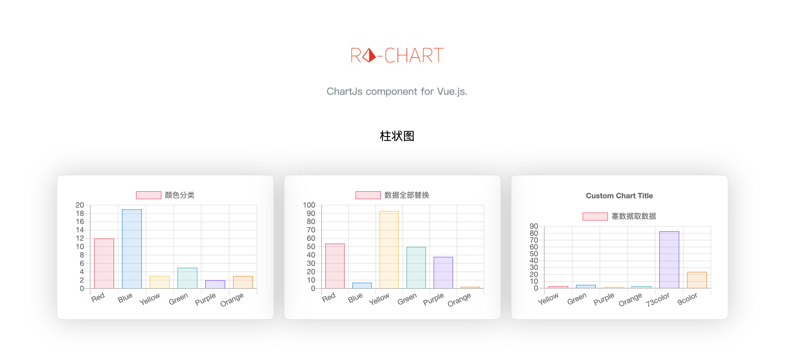

<div style="text-align:center">
    
    <h6 style="color:#ED6B64">ra-vchart: chartJs 的 Vue.js 组件。</h6>
    <p style="color:#7f8c8d; font-size:14px;">基于<a src="https://www.chartjs.org/"> chart.js-v2.9.3 </a>开发，依赖<a src="https://vuejs.org/"> Vue.js-v2.6.10 </a>。</p>
</div>

## ra-chart
> chartJs 的 Vue.js 组件。

基于 [chart.js](https://www.chartjs.org/) `v4.1.0`+ 开发，依赖 [Vue.js](https://vuejs.org/) `v2.6.10`+。



## Demo & Docs
* [demo](https://ra-vchart.logiczc.now.sh/)

## install
```sh
# npm
npm install --save ra-chart
# yarn
yarn add ra-chart
```
## Usage
通过导入整个ra-chart或每个模块来获取图表组件
```js
import RaChart from 'ra-chart'
import {RaBar, RaLine} from 'ra-chart'
```
在Vue中使用
```js
<ra-bar
    :element-id="'bar'"
    :chart-data="datas"
    :chart-options="options"
    :css-style="{ width: '300px', height: '200px' }"
>
</ra-bar>

return {
  datas: {
    labels: ['Red', 'Blue', 'Yellow', 'Green', 'Purple', 'Orange'],
    datasets: [
      {
        label: '颜色分类',
        data: [12, 19, 3, 5, 2, 3],
        backgroundColor: [
          'rgba(255, 99, 132, 0.2)',
          'rgba(54, 162, 235, 0.2)',
          'rgba(255, 206, 86, 0.2)',
          'rgba(75, 192, 192, 0.2)',
          'rgba(153, 102, 255, 0.2)',
          'rgba(255, 159, 64, 0.2)',
        ],
        borderColor: [
          'rgba(255, 99, 132, 1)',
          'rgba(54, 162, 235, 1)',
          'rgba(255, 206, 86, 1)',
          'rgba(75, 192, 192, 1)',
          'rgba(153, 102, 255, 1)',
          'rgba(255, 159, 64, 1)',
        ],
        borderWidth: 1,
      },
    ],
  },
  options: {
    scales: {
      yAxes: [
        {
          ticks: {
            beginAtZero: true,
          },
        },
      ],
    },
    responsive: true,
    maintainAspectRatio: false,
  },
};
```
更多示例，可以参考[example](./example/App.vue)。

## CHANGELOG
[](./CHANGELOG.md)

## MIT
[MIT](./LICENCE)